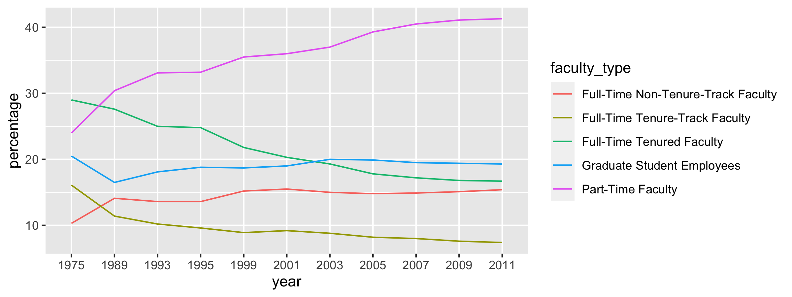

```{r load-packages, include=FALSE}
library(tidyverse)
library(knitr)
```

The code below brings you to the point in the slides where we left off...

```{r message=FALSE}
staff <- read_csv("data/instructional-staff.csv")
staff_long <- staff %>%
  pivot_longer(
    cols = -faculty_type, 
    names_to = "year", 
    values_to = "percentage"
    )
```

**Tip:** Knit the document once before you get started.

---

#### Exercise 1.

Recreate the line plot from the slides (also provided below), and make sure 
the figure width (defined as a code chunk option with `fig.width`) is large 
enough to make it legible. Also fix the title, axis labels, and legend label.

**Stretch goal:** Change the theme of the plot to a different one of your liking. 
See the examples at the bottom of https://ggplot2.tidyverse.org/reference/ggtheme.html for inspiration.

```{r line-plot-img, echo=FALSE}

```

```{r line-plot, fig.width=3}
# add your code here
```

---

#### Exercise 2.

Suppose the objective of this plot was to show that the proportion of 
part-time faculty have gone up over time compared to other instructional 
staff types. What changes would you propose making to this plot to tell this 
story. Discuss and take notes.

**Stretch goal:** Implement those changes below.

```{r better-line}
# add your code here
```

