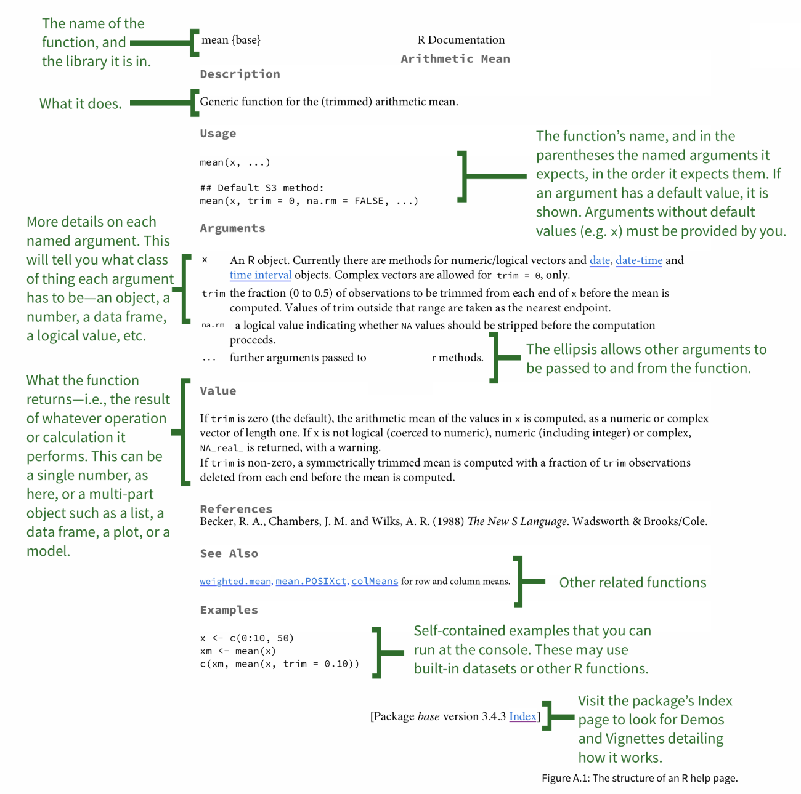

```{r child = "../setup.Rmd"}
```

```{r packages, echo=FALSE, message=FALSE, warning=FALSE}
library(tidyverse)
```

class: center, middle

# Welcome!

---

## About me

.pull-left[
```{r echo=FALSE,out.width="80%",fig.align="center"}
knitr::include_graphics("img/mine_circle.png")
```
]
.pull-right[
__Mine Çetinkaya-Rundel__
- Data Scientist & Professional Educator, RStudio
- Senior Lecturer, University of Edinburgh
- Associate Professor of the Practice, Duke University

.midi[
`r emo::ji("link")`  [mine-cr.com](http://mine-cr.com)  
`r emo::ji("writing_hand")`  [citizen-statistician.org](http://citizen-statistician.org)  
`r emo::ji("bird")`  [@minebocek](https://twitter.com/minebocek)  
`r emo::ji("radio_button")`  she/her  
]
]

---

class: center, middle

## About you?

---

## Logistics

- Everything in one place: [rstd.io/bootcamper](http://rstd.io/bootcamper)
- RStudio Cloud: [rstd.io/bootcamper-cloud](https://rstd.io/bootcamper-cloud)
- Asking for help:
  - Just interrupt!
  - Or type in chat (but if I don't see it, feel free to interrupt!)

---

class: center, middle

# Data in the wild

---

## The US of Bey

```{r fig.align="center", echo=FALSE, alt="The US of Bey", out.width="65%"}
knitr::include_graphics("img/brooke-watson-us-of-bey.gif")
```

Brooke Watson, [blog.brooke.science/posts/the-us-of-bey](https://blog.brooke.science/posts/the-us-of-bey/)

---

## Punctuation in literature

```{r fig.align="center", echo=FALSE, alt="Punctuation", out.width="48%"}
knitr::include_graphics("img/julia-silge-punctuation.png")
```

Julia Silge, [juliasilge.com/blog/punctution-literature](https://juliasilge.com/blog/punctution-literature/)

---

## Text analysis of Trump's tweets

```{r fig.align="center", echo=FALSE, alt="Trump tweets", out.width="63%"}
knitr::include_graphics("img/david-robinson-trump-tweets.png")
```

David Robinson, [varianceexplained.org/r/trump-tweets](http://varianceexplained.org/r/trump-tweets)

---

## Greatest Twitter scheme of all time

```{r fig.align="center", echo=FALSE, out.width = "43%"}
knitr::include_graphics("img/bohemian-rhapsody.png")
```

.small[
[gist.github.com/mine-cetinkaya-rundel/03d7516dea1e5f2613a5d71c28edb08d](https://gist.github.com/mine-cetinkaya-rundel/03d7516dea1e5f2613a5d71c28edb08d)
]

---

## `r emo::ji("computer")` Your turn

- Go to [rstd.io/bootcamper-cloud](https://rstd.io/bootcamper-cloud) and join the 
RStudio Cloud workspace for the bootcamp.
- Start the first assignment: `01 - Whole game`
- Open `01-unvotes-rmd.Rmd` and knit the document.
- Change "Turkey" to another country and knit again. Compare with breakout room-mates(?)
how the country you chose voted on certain issues.

```{r echo=FALSE}
countdown(minutes = 5)
```

---

## `r emo::ji("computer")` Demo

Continue to work in the first assignment: `01 - Whole game`

- Open `02-unvotes-rmd-param.Rmd` and knit the document.
- Open `03-unvotes-shiny.Rmd` and knit the document.

---

class: center, middle

# R

---

## R

- R can be used as a calculator.
```{r}
8738787213 / 1653
```


- The most commonly used data type in R is data frames, where each row represents 
an observation, and each column a variable.

```{r}
mtcars
```

---

## R

- We use the `$` operator to access a variable within a data frame.

```{r}
mtcars$mpg
```

- Functions are (often) verbs, followed by what they will be applied to in parantheses.

```{r eval=FALSE}
do_this(to_this)
do_that(to_this, to_that, with_those)
```

---

## R

- In R, the fundamental unit of shareable code is the package.
- As of September 2019, there are over 14,000 packages available on the **C**omprehensive **R** **A**rchive **N**etwork (CRAN), the public clearing house for R packages. 
- This huge variety of packages is one reason why R is so successful: the chances are that someone has already solved a problem that you’re working on, and you can benefit from their work by downloading their package.
- Using R packages:
  - Install them from CRAN with `install.packages("x")`
  - Use them in R with `library(x)`
  - Get help on them with package `?x` and `help(package = "x")`

---

class: center, middle

# RStudio

---

## RStudio

```{r echo=FALSE, out.width="80%", fig.align="center"}
knitr::include_graphics("img/rstudio-anatomy.png")
```

---

class: center, middle

# R Markdown

---

## R Markdown

```{r echo=FALSE, out.width="100%", fig.align="center"}
knitr::include_graphics("img/rmarkdown-anatomy.png")
```

---

## R Markdown tips

- Most importantly: environment of your R Markdown document is separate from that of the Console
- Help:
  - [R Markdown cheat sheet](https://github.com/rstudio/cheatsheets/raw/master/rmarkdown-2.0.pdf) 
  - Markdown Quick Reference (Help -> Markdown Quick Reference)

---

## How will we use R Markdown?

- Every "your turn" exercise is an R Markdown document
- You'll always have a template R Markdown document to start with
- The amount of scaffolding in the template will decrease over the bootcamp

---

class: center, middle

```{r echo=FALSE,out.width="50%"}
knitr::include_graphics("img/tidyverse.png")
```


---

## tidyverse

.pull-left[
The tidyverse is an opinionated collection of R packages designed for data science. 
All packages share an underlying design philosophy, grammar, and data structures.
]
.pull-right[
```{r echo=FALSE}
knitr::include_graphics("img/tidyverse-packages.png")
```
]


---

class: center, middle

# Getting help in R

---

## Reading help files

```{r echo=FALSE, out.width="50%", fig.align="center"}

```

.tiny[
Source: http://socviz.co/appendix.html#a-little-more-about-r
]
