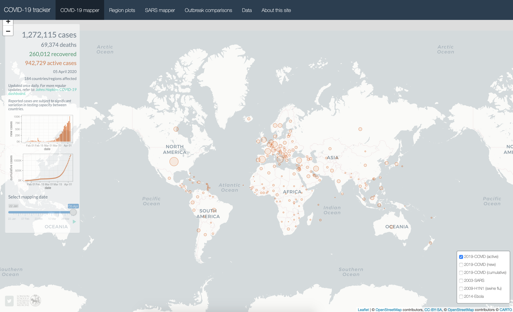
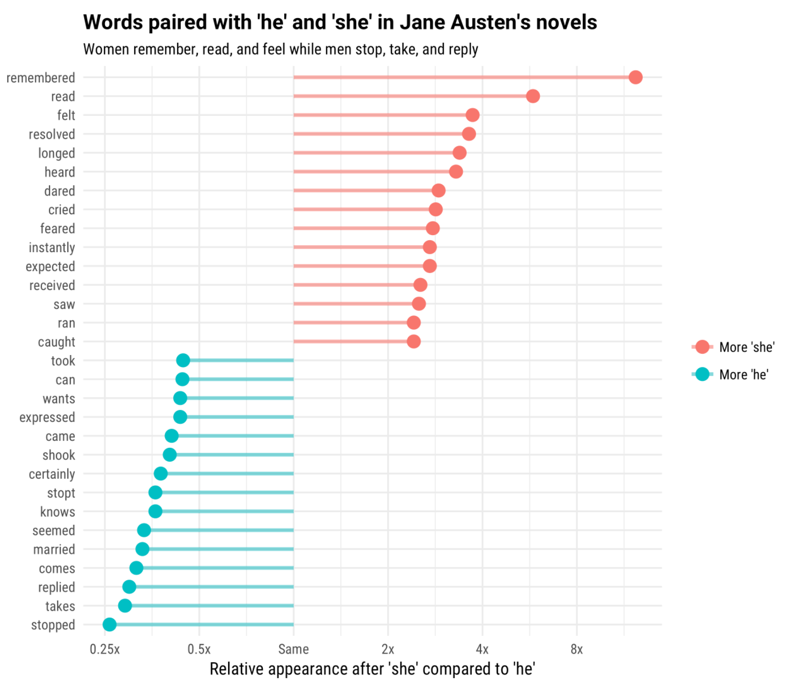

```{r child = "../setup.Rmd"}
```

```{r packages, echo=FALSE, message=FALSE, warning=FALSE}
library(tidyverse)
library(nycflights13)
```

class: middle

# Welcome!

---

## About me

.pull-left[
```{r echo=FALSE,out.width="80%",fig.align="center"}
knitr::include_graphics("img/mine_circle.png")
```
]
.pull-right[
__Mine Çetinkaya-Rundel__
- Data Scientist & Professional Educator, RStudio
- Senior Lecturer, University of Edinburgh
- Associate Professor of the Practice, Duke University

.midi[
`r emo::ji("link")`  [mine-cr.com](http://mine-cr.com)  
`r emo::ji("writing_hand")`  [citizen-statistician.org](http://citizen-statistician.org)  
`r emo::ji("bird")`  [@minebocek](https://twitter.com/minebocek)  
`r emo::ji("radio_button")`  she/her  
]
]

---

class: center, middle

## About you?

---

## Logistics

- Everything in one place: [rstd.io/bootcamper](http://rstd.io/bootcamper)
- RStudio Cloud: [rstd.io/bootcamper-cloud](https://rstd.io/bootcamper-cloud)
- Asking for help: Just interrupt! Or type in chat (but if I don't see it, feel free to interrupt!)

---

class: center, middle

# Data in the wild

---

```{r fig.align="center", echo=FALSE, alt="COVID-19 Tracker", out.width="90%"}

```

.xsmall[
Edward Parker, [vac-lshtm.shinyapps.io/ncov_tracker](https://vac-lshtm.shinyapps.io/ncov_tracker/) (See [bit.ly/covid19-r](http://bit.ly/covid19-r) for more COVID-19 analysis in R.)
]

---

```{r fig.align="center", echo=FALSE, alt="Gender roles in Jane Austen novels", out.width="60%"}

```

.xsmall[
Julia Silge, [juliasilge.com/blog/gender-pronouns](https://juliasilge.com/blog/gender-pronouns/)
]

---

```{r fig.align="center", echo=FALSE, alt="Trump tweets", out.width="65%"}
knitr::include_graphics("img/david-robinson-trump-tweets.png")
```

.xsmall[
David Robinson, [varianceexplained.org/r/trump-tweets](http://varianceexplained.org/r/trump-tweets)
]

---

```{r fig.align="center", echo=FALSE, alt="The US of Bey", out.width="70%"}
knitr::include_graphics("img/brooke-watson-us-of-bey.gif")
```

.xsmall[
Brooke Watson, [blog.brooke.science/posts/the-us-of-bey](https://blog.brooke.science/posts/the-us-of-bey/)
]

---

.your-turn[
- Go to [rstd.io/bootcamper-cloud](https://rstd.io/bootcamper-cloud) and join the 
RStudio Cloud workspace for the bootcamp.
- Start the first assignment: `01 - Whole game`.
- Open `01-covid-rmd.Rmd` and knit the document.
- Change "Turkey" to another country and knit again. Compare with breakout room-mates(?) how the country you chose voted on certain issues.
]

```{r echo=FALSE}
countdown(minutes = 10)
```

---

## `r emo::ji("computer")` Demo: Parametrized reports

Continue to work in the first assignment: `01 - Whole game`

- Open `02-covid-rmd-param.Rmd` and knit the document.
- Knit with parameters.
- View deployed parameterized document at [connect.rstudioservices.com/covid-rmd](https://connect.rstudioservices.com/covid-rmd/).
- Change parameters on RStudio Connect and reproduce report.

---

## `r emo::ji("computer")` Demo: Shiny apps

Continue to work in the first assignment: `01 - Whole game`

- Open `03-covid-shiny.Rmd` and knit the document, change inputs in app and observe the visualisation react.
- View deployed Shiny app at [connect.rstudioservices.com/covid-shiny](https://connect.rstudioservices.com/covid-shiny/)

---

class: middle

.huge-blue[R]

---

## R

- R can be used as a calculator.
```{r}
8738787213 / 1653
```

- The most commonly used data type in R is data frames, where each row represents an observation, and each column a variable.

```{r echo=FALSE}
head(presidential) %>% as.data.frame()
```

---

## R

- We use the `$` operator to access a variable within a data frame.

```{r}
presidential$name
```

- Functions are (often) verbs, followed by what they will be applied to in parentheses.

```{r eval=FALSE}
do_this(to_this)
do_that(to_this, to_that, with_those)
```

---

## R

- In R, the fundamental unit of shareable code is the package.
--

- As of April 2020, there are over 15,000 packages available on the **C**omprehensive **R** **A**rchive **N**etwork (CRAN), the public clearing house for R packages. Source: [r-pkg.org](https://www.r-pkg.org/).
--

- This huge variety of packages is one reason why R is so successful: the chances are that someone has already solved a problem that you’re working on, and you can benefit from their work by downloading their package.
--

- Using R packages:
  - Install them from CRAN with `install.packages("x")`
  - Use them in R with `library(x)`
  - Get help on them with package `?x` and `help(package = "x")`

---

class: middle

.huge-blue[RStudio]

---

## RStudio

```{r echo=FALSE, out.width="80%", fig.align="center"}
knitr::include_graphics("img/rstudio-anatomy.png")
```

---

class: middle

.huge-blue[R Markdown]

---

## R Markdown

```{r echo=FALSE, out.width="100%", fig.align="center"}
knitr::include_graphics("img/rmarkdown-anatomy.png")
```

---

## How will we use R Markdown?

- Every "your turn" exercise is an R Markdown document
- You'll always have a template R Markdown document to start with
- The amount of scaffolding in the template will decrease over the bootcamp

---

class: middle

.huge-blue[tidyverse]

```{r echo=FALSE,out.width="15%", fig.align="right"}
knitr::include_graphics("img/tidyverse.png")
```

---

## tidyverse

.pull-left[
The tidyverse is an opinionated collection of R packages designed for data science. 

All packages share an underlying design philosophy, grammar, and data structures.
]
.pull-right[
```{r echo=FALSE}
knitr::include_graphics("img/tidyverse-packages.png")
```
]


---

class: middle

.huge-blue[Getting help in R]

---

## Reading help files

.pull-left[
You can get help on any function by typing the function name in the Console with a `?` before it:

```{r eval=FALSE}
?mean
```
]
.pull-right[
```{r echo=FALSE, out.width="100%", fig.align="center"}
knitr::include_graphics("img/r-help.png")
```
]

.xsmall[
Source: http://socviz.co/appendix.html#a-little-more-about-r
]

---

## Package help

- **Many** modern packages have user friendly web pages with function descriptions, code examples, and vignettes (problem-oriented long form articles that walk you through features of the package), e.g. [ggplot2.tidyverse.org](https://ggplot2.tidyverse.org/).
--

- **All** packages on CRAN have a dedicated with high-level package documentation such as a description, dependencies, etc. as well as a link to a PDF reference manual, e.g.  [cran.r-project.org/web/packages/ggplot2](https://cran.r-project.org/web/packages/ggplot2/index.html).
--

- **Some** packages also have cheatsheets which can be quite handy! [rstudio.com/resources/cheatsheets](https://rstudio.com/resources/cheatsheets/)
  
.alert[
I recommend using the package websites when available since they display output of code in the examples whereas the help in R and reference manual does not.
]

---

.your-turn[
Take a few minutes in breakout sessions to come up with a list of 1-2 questions you would like clarified before we move on to the next module.
]

```{r echo=FALSE}
countdown(minutes = 3)
```
