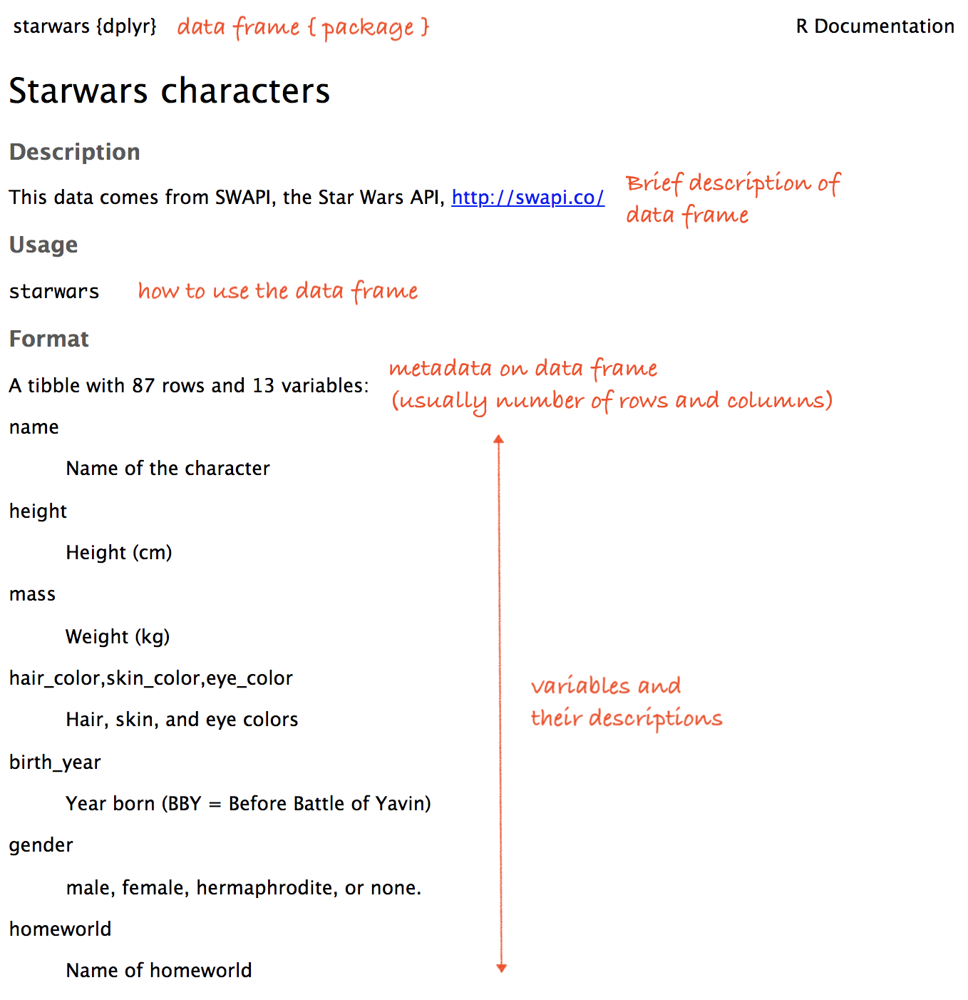
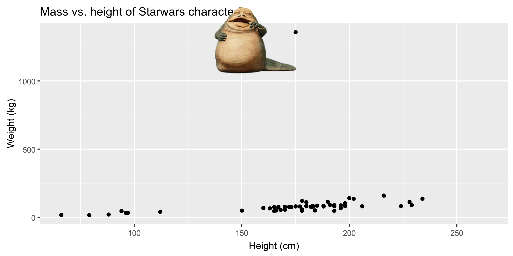

```{r child = "../setup.Rmd"}
```

```{r packages, echo=FALSE, message=FALSE, warning=FALSE}
library(tidyverse)
library(magick)
library(knitr)
```

class: middle

# Data visualization

---

## Data visualization

> *"The simple graph has brought more information to the data analyst’s mind than any other device." — John Tukey*

- Data visualization is the creation and study of the visual representation of data.
- There are many tools for visualizing data (R is one of them), and many approaches/systems within R for making data visualizations (**ggplot2** is one of them, and that's what we're going to use).

---

## ggplot2 $\in$ tidyverse

.pull-left[
```{r echo=FALSE, out.width="80%",fig.align="center"}
knitr::include_graphics("img/ggplot2-part-of-tidyverse.png")
```
]
.pull-right[
```{r message=FALSE}
library(tidyverse)
```
- **ggplot2** is tidyverse's data visualization package
- The `gg` in "ggplot2" stands for Grammar of Graphics
- It is inspired by the book **Grammar of Graphics** by Leland Wilkinson
]

---

## Grammar of Graphics

A grammar of graphics is a tool that enables us to concisely describe the components of a graphic.

```{r echo=FALSE, out.width="60%",fig.align="center"}
knitr::include_graphics("img/grammar-of-graphics.png")
```

.footnote[ 
Source: [BloggoType](http://bloggotype.blogspot.com/2016/08/holiday-notes2-grammar-of-graphics.html)
]

---

```{r out.width="60%"}
ggplot(data = starwars, mapping = aes(x = height, y = mass)) +
  geom_point() +
  labs(title = "Mass vs. height of Starwars characters",
       x = "Height (cm)", y = "Weight (kg)")
```

---

.discussion[
- What are the functions doing the plotting? 
- What is the dataset being plotted? 
- Which variable is on the x-axis and which variable is on the y-axis? 
- What does the warning mean?
]

```{r eval=FALSE}
ggplot(data = starwars, mapping = aes(x = height, y = mass)) +
  geom_point() +
  labs(
    title = "Mass vs. height of Starwars characters",
    x = "Height (cm)", 
    y = "Weight (kg)"
    )
```

```
## Warning: Removed 28 rows containing missing values (geom_point).
```

---

.discussion[
What does `geom_smooth()` do?
]

```{r out.width="50%", warning=FALSE, message=FALSE}
ggplot(data = starwars, mapping = aes(x = height, y = mass)) +
  geom_point() +
  geom_smooth() + #<<
  labs(title = "Mass vs. height of Starwars characters",
       x = "Height (cm)", y = "Weight (kg)")
```

---

## Hello ggplot2!

- `ggplot()` is the main function in ggplot2 
- Plots are constructed in layers
- Structure of the code for plots can be summarized as
```{r eval = FALSE}
ggplot(data = [dataset], 
       mapping = aes(x = [x-variable], y = [y-variable])) +
   geom_xxx() +
   other options
```
- For help with the ggplot2
  + [ggplot2.tidyverse.org](http://ggplot2.tidyverse.org/)
  + [ggplot cheat sheet](https://github.com/rstudio/cheatsheets/blob/master/data-visualization-2.1.pdf)

---

class: middle

# Visualizing Star Wars

---

## Dataset terminology

- Each row is an **observation**
- Each column is a **variable**

```{r message=FALSE, echo=FALSE}
options(width=90)
starwars
```

---

## Luke Skywalker


---

## What's in the Star Wars data?

```{r}
glimpse(starwars)
```

---

## Another look at Star Wars data

.pull-left[
The **skimr** package provides summary statistics the user can skim quickly to 
understand their data.
```{r eval=FALSE}
library(skimr)
skim(starwars)
```
]
.pull-right[
```{r echo=FALSE, out.width="50%", fig.align="center"}
knitr::include_graphics("img/skimr.png")
```
]

---

.xsmall[
```{r message=FALSE, results="md", echo=FALSE, render = normal_print}
options(width=120)
library(skimr)
skim(starwars)
```
]

---

## What's in the Star Wars data?

.pull-left[
.discussion[
How many rows and columns does this dataset have? What does each row represent? What does each column represent?
]
```{r eval = FALSE}
?starwars
```
]
.pull-right[
```{r echo=FALSE, out.width="100%"}

```
]

---

## Mass vs. height

```{r out.width="60%"}
ggplot(data = starwars, mapping = aes(x = height, y = mass)) +
  geom_point()
```

---

.your-turn[
- Go to RStudio Cloud and start the second assignment: `02 - Visualize Data`.
- Open the first R Markdown file: `01-starwars.Rmd`.
- Answer the first two questions, and if time allows also the third one.
- But, a mini R Markdown review before you get started!
]

```{r echo=FALSE}
countdown(minutes = 5, seconds = 00)
```

.footnote[
RStudio Cloud workspace for this bootcamp  
is at  [rstd.io/bootcamper-cloud](https://rstd.io/bootcamper-cloud).
]

---

## Labels

.small[
```{r out.width="70%", warning=FALSE}
ggplot(data = starwars, mapping = aes(x = height, y = mass)) +
  geom_point() +
  labs(title = "Mass vs. height of Starwars characters", #<<
       x = "Height (cm)",                                #<<
       y = "Weight (kg)")                                #<<
```
]

---

## Mass vs. height

.discussion[
How would you describe this relationship? What other variables would help us understand data points that don't follow the overall trend? Who is the not so tall but really chubby character?
]

```{r out.width="60%", warning=FALSE,echo=FALSE}
ggplot(data = starwars, mapping = aes(x = height, y = mass)) +
  geom_point() +
  labs(title = "Mass vs. height of Starwars characters",
       x = "Height (cm)", y = "Weight (kg)")
```

---

## Jabba!

```{r echo=FALSE, warning=FALSE, cache=TRUE}
jabba <- image_read("img/jabba.png")

fig <- image_graph(width = 2400, height = 1200, res = 300)
ggplot(data = starwars, mapping = aes(x = height, y = mass)) +
  geom_point(size = 1.5) + 
  labs(title = "Mass vs. height of Starwars characters",
       x = "Height (cm)", y = "Weight (kg)")
dev.off()

out <- fig %>% image_composite(jabba, offset = "+1000+30")

image_write(out, "img/jabbaplot.png", format = "png")

```

---

## Additional variables

We can map additional variables to various features of the plot:

- aesthetics
    - shape
    - colour
    - fill
    - size
    - alpha (transparency)
- faceting: small multiples displaying different subsets

---

class: middle

# Aesthetics

---

## Aesthetics options

Visual characteristics of plotting characters that can be **mapped to a specific variable**
in the data are

- `color`
- `size`
- `fill`
- `shape`
- `alpha` (transparency)

---

## Mass vs. height + gender

```{r out.width="70%", warning=FALSE}
ggplot(data = starwars, 
       mapping = aes(x = height, y = mass, color = gender)) +
  geom_point()
```

---

## Mass vs. height + gender

```{r out.width="65%", warning=FALSE}
ggplot(data = starwars, 
       mapping = aes(x = height, y = mass, color = gender, 
                     size = birth_year)) + #<<
  geom_point()
```

---

## Fix it up!

.midi[
```{r eval=FALSE}
ggplot(data = starwars, 
       mapping = aes(x = height, 
                     y = mass, 
                     color = gender, 
                     size = birth_year)) +
  geom_point(alpha = 0.7) +
  labs(title = "Mass vs. height of Starwars characters",
       subtitle = "by gender and birth year",
       x = "Height (cm)", 
       y = "Weight (kg)",
       color = "Gender",
       size = "Birth year") +
  theme_minimal() +
  theme(legend.direction = "horizontal", 
        legend.position = "bottom", 
        legend.box = "vertical")
```
]

---

```{r warning=FALSE, echo=FALSE, fig.height=4.5,fig.width=8}
ggplot(data = starwars, 
       mapping = aes(x = height, 
                     y = mass, 
                     color = gender, 
                     size = birth_year)) +
  geom_point(alpha = 0.7) +
  labs(title = "Mass vs. height of Starwars characters",
       subtitle = "by gender and birth year",
       x = "Height (cm)", 
       y = "Weight (kg)",
       color = "Gender",
       size = "Birth year") +
  theme_minimal() +
  theme(legend.direction = "horizontal", 
        legend.position = "bottom", 
        legend.box = "vertical")
```

---

## Mass vs. height + gender

Let's now increase the size of all points *not* based on the values of a 
variable in the data, i.e. **set** size instead of **map** size:

.midi[
```{r out.width="63%", warning=FALSE}
ggplot(data = starwars, mapping = aes(x = height, y = mass, color = gender)) +
  geom_point(size = 2) #<<
```
]

---

## Aesthetics summary

- Continuous variable are measured on a continuous scale
- Discrete variables are measured (or often counted) on a discrete scale

aesthetics    | discrete                 | continuous
------------- | ------------------------ | ------------
color         | rainbow of colors        | gradient
size          | discrete steps           | linear mapping between radius and value
shape         | different shape for each | *shouldn't (and doesn't) work*

- Use aesthetics for mapping features of a plot to a variable, define the 
features in the geom for customization **not** mapped to a variable

---

class: middle

# Faceting

---

## Faceting

- Smaller plots that display different subsets of the data
- Useful for exploring conditional relationships and large data

---

```{r fig.width=8, warning=FALSE}
ggplot(data = starwars, mapping = aes(x = height, y = mass)) +
  facet_grid(. ~ gender) + #<<
  geom_point() +
  labs(title = "Mass vs. height of Starwars characters",
       subtitle = "Faceted by gender")  #<<
```

---

.your-turn[
Look through the next three slides titled Facet 1, 2, and 3 describe what each plot displays. Think about how the code relates to the output.

**Note:** The plots in the next few slides do not have proper titles, axis labels, etc. because we want you to figure out what's happening in the plots. But you should always label your plots!
]

```{r echo=FALSE}
countdown(minutes = 3, seconds = 00)
```

---

### Facet 1

```{r fig.width=7, fig.height=3, warning=FALSE}
ggplot(data = starwars, mapping = aes(x = height, y = mass)) +
  geom_point() +
  facet_grid(gender ~ .)
```

---

### Facet 2

```{r fig.width=8, warning=FALSE}
ggplot(data = starwars, mapping = aes(x = height, y = mass)) +
  geom_point() +
  facet_grid(. ~ gender)
```

---

### Facet 3

```{r fig.width=7, fig.height=3, warning=FALSE}
ggplot(data = starwars, mapping = aes(x = height, y = mass)) +
  geom_point() +
  facet_wrap(~ eye_color)
```

---

## Facet summary

- `facet_grid()`: 
    - 2d grid
    - `rows ~ cols`
    - use `.` for no split
- `facet_wrap()`: 1d ribbon wrapped into 2d

---

class: middle

# Why do we visualize?

---

.discussion[
Do you see anything out of the ordinary?
]

```{r fig.height=3, fig.width=6, echo=FALSE, warning=FALSE}
ggplot(dsbox::student_survey, aes(x = first_kiss)) +
  geom_histogram(binwidth = 1) +
  labs(title = "How old were you when you had your first kiss?", x = "")
```

---

.discussion[
How are people reporting lower vs. higher values of FB visits?
]

```{r fig.height=3, fig.width=6, echo=FALSE, warning=FALSE}
ggplot(dsbox::student_survey, aes(x = fb_visits_per_day)) +
  geom_histogram(binwidth = 1) +
  labs(title = "How many times do you go on Facebook per day?", x = "")
```

---

class: middle

# Identifying variables

---

## Types of variables

- **Numerical variables** can be classified as **continuous** or **discrete** based on whether or not the variable can take on an infinite number of values or only non-negative whole numbers, respectively. 
- If the variable is **categorical**, we can determine if it is **ordinal** based on whether or not the levels have a natural ordering. R uses the term 
**factor** for most categorical data.

---

class: middle

# Visualizing numerical data

---

## Histograms

```{r out.width="75%", warning=FALSE}
ggplot(data = starwars, mapping = aes(x = height)) +
  geom_histogram(binwidth = 10)
```

---

## Density plots

```{r out.width="75%", warning = FALSE}
ggplot(data = starwars, mapping = aes(x = height)) +
  geom_density()
```

---

## Box plots

```{r out.width="60%", warning = FALSE}
ggplot(data = starwars, mapping = aes(y = height)) +
  geom_boxplot()
```

---

class: middle

# Visualizing relationships between numerical and categorical data

---

## Side-by-side box plots

```{r out.width="75%", warning=FALSE}
ggplot(data = starwars, mapping = aes(y = height, x = gender)) +
  geom_boxplot()
```

---

## Scatter plot...

This is not a great representation of these data.

```{r out.width="60%", warning=FALSE}
ggplot(data = starwars, mapping = aes(y = height, x = gender)) +
  geom_point()
```

---

## Violin plots

```{r out.width="75%", warning=FALSE}
ggplot(data = starwars, mapping = aes(y = height, x = gender)) +
  geom_violin()
```

---

## Jitter plot

```{r echo=FALSE}
set.seed(1234)
```


```{r out.width="75%", warning=FALSE}
ggplot(data = starwars, mapping = aes(y = height, x = gender)) +
  geom_jitter()
```

---

## Beeswarm plots

```{r out.width="70%", warning = FALSE}
library(ggbeeswarm)
ggplot(data = starwars, mapping = aes(y = height, x = gender)) +
  geom_beeswarm()
```

---

class: middle

# Visualizing categorical data

---

## Bar plots

```{r out.width="70%"}
ggplot(data = starwars, mapping = aes(x = gender)) +
  geom_bar()
```

---

## Segmented bar plots, counts

.midi[
```{r fig.width=7,fig.height=3}
ggplot(data = starwars, mapping = aes(x = gender, fill = hair_color)) +
  geom_bar()
```
]

---

## Recode hair color

Using the `fct_other()` function from the **forcats** package, which is also part of the **tidyverse**.

```{r}
starwars <- starwars %>%
  mutate(
    hair_color2 = fct_lump_min(hair_color, min = 10)
  )
```

---

## Segmented bar plots, counts

```{r out.width="65%"}
ggplot(data = starwars, 
       mapping = aes(y = gender, fill = hair_color2)) +
  geom_bar()
```

---

## Segmented bar plots, proportions

```{r out.width="65%"}
ggplot(data = starwars, 
       mapping = aes(y = gender, fill = hair_color2)) +
  geom_bar(position = "fill") +
  labs(x = "proportion")
```

---

.discussion[
Which bar plot is a more useful representation for visualizing the relationship between gender and hair color?
]

.pull-left[
```{r echo=FALSE, out.width="95%"}
ggplot(data = starwars, mapping = aes(y = gender, fill = hair_color2)) +
  geom_bar()
```
]
.pull-right[
```{r echo=FALSE, out.width="95%"}
ggplot(data = starwars, mapping = aes(y = gender, fill = hair_color2)) +
  geom_bar(position = "fill") +
  labs(x = "proportion")
```
]

---

.your-turn[
- Go to RStudio Cloud and start the second assignment: `02 - Visualize Data`
- Open the first R Markdown file: `02-why.visualize.Rmd`
- Knit the document
]

```{r echo=FALSE}
countdown(minutes = 5, seconds = 00)
```

.footnote[
RStudio Cloud workspace for this bootcamp  
is at  [rstd.io/bootcamper-cloud](https://rstd.io/bootcamper-cloud).
]

